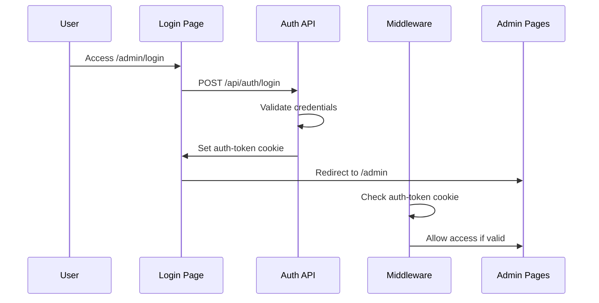

# Design Document

## Overview

Sau khi phân tích hệ thống đăng nhập admin hiện tại, đã xác định được các vấn đề chính gây ra lỗi đăng nhập:

1. **Hash mật khẩu không hợp lệ**: Hash trong `login/route.ts` có vẻ không được tạo đúng cách
2. **Vấn đề với cookie handling**: Có thể có vấn đề với việc set/get cookie giữa client và server
3. **CORS và credential issues**: Có thể có vấn đề với CORS headers và credential handling
4. **Middleware logic**: Logic middleware có thể gây conflict với auth flow

## Architecture

### Current Authentication Flow


### Identified Issues
1. **Password Hash Issue**: Hash `$2a$10$XFDv5J5H5UzQ7zXv5q5Q0Oc5Z5X5Z5X5Z5X5Z5X5Z5X5Z5X5Z5X5Z5` không hợp lệ
2. **Cookie Configuration**: Có thể cần điều chỉnh cookie settings
3. **Auth Check Logic**: Logic kiểm tra auth có thể cần cải thiện

## Components and Interfaces

### 1. Authentication API Endpoints

#### `/api/auth/login`
- **Input**: `{ username: string, password: string }`
- **Output**: `{ success: boolean, user?: object, message?: string }`
- **Cookie**: Set `auth-token` với proper configuration

#### `/api/auth/check`
- **Input**: Cookie `auth-token`
- **Output**: `{ authenticated: boolean, user?: object }`

#### `/api/auth/logout`
- **Input**: None
- **Output**: `{ message: string }`
- **Action**: Clear `auth-token` cookie

### 2. Client Components

#### Login Page (`/admin/login/page.tsx`)
- Form validation
- Error handling
- Loading states
- Redirect logic

#### AuthProvider (`/components/auth/AuthProvider.tsx`)
- Wrap admin layout
- Check authentication status
- Handle redirects

#### withAuth HOC (`/components/auth/withAuth.tsx`)
- Higher-order component for protected routes
- Authentication checking
- Loading states

### 3. Middleware (`middleware.ts`)
- Route protection
- Cookie validation
- Redirect logic

## Data Models

### User Model
```typescript
interface User {
  username: string;
}
```

### Auth Token
```typescript
interface AuthToken {
  value: string;
  expires: Date;
  httpOnly: boolean;
  secure: boolean;
  sameSite: 'lax' | 'strict' | 'none';
}
```

### Auth Response
```typescript
interface AuthResponse {
  success: boolean;
  authenticated?: boolean;
  user?: User;
  message?: string;
}
```

## Error Handling

### 1. API Level Errors
- Invalid credentials (401)
- Server errors (500)
- Network errors
- Proper error messages in Vietnamese

### 2. Client Level Errors
- Form validation errors
- Network connectivity issues
- Session expiration
- User-friendly error messages

### 3. Middleware Level Errors
- Invalid tokens
- Expired sessions
- Route access denied

## Testing Strategy

### 1. Authentication Flow Testing
- Valid login credentials
- Invalid login credentials
- Session persistence
- Logout functionality

### 2. Route Protection Testing
- Access protected routes without auth
- Access protected routes with valid auth
- Middleware redirect behavior

### 3. Error Handling Testing
- Network failure scenarios
- Invalid token scenarios
- Server error scenarios

## Implementation Plan

### Phase 1: Fix Core Authentication
1. **Fix Password Hash**: Tạo hash mật khẩu đúng cho password mặc định
2. **Improve Cookie Handling**: Đảm bảo cookie được set và read đúng cách
3. **Fix Auth Check Logic**: Cải thiện logic kiểm tra authentication

### Phase 2: Enhance Error Handling
1. **Better Error Messages**: Cải thiện thông báo lỗi cho user
2. **Logging**: Thêm logging để debug
3. **Validation**: Cải thiện validation ở client và server

### Phase 3: Security Improvements
1. **Token Security**: Cải thiện security của token
2. **Session Management**: Cải thiện quản lý session
3. **CORS Configuration**: Đảm bảo CORS được config đúng

## Security Considerations

1. **Password Security**: Sử dụng bcrypt với proper salt rounds
2. **Token Security**: Implement proper token generation và validation
3. **Cookie Security**: HttpOnly, Secure, SameSite attributes
4. **Session Management**: Proper session timeout và cleanup
5. **CSRF Protection**: Implement CSRF protection nếu cần

## Performance Considerations

1. **Auth Check Optimization**: Cache auth status khi có thể
2. **Cookie Size**: Giữ cookie size nhỏ
3. **API Response Time**: Optimize auth API response time
4. **Client-side Caching**: Cache user info appropriately